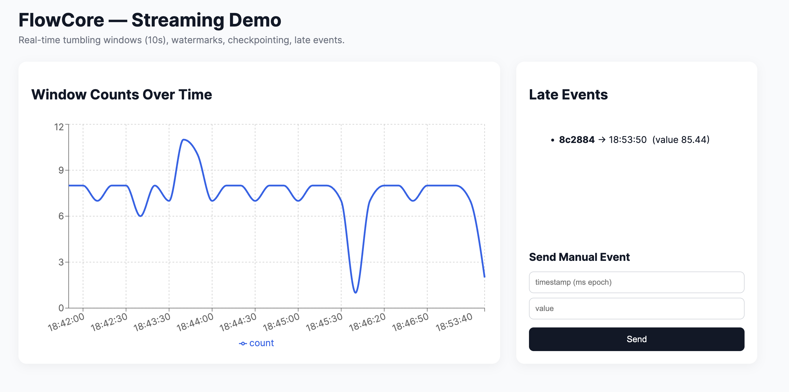

# FlowCore — Streaming Engine

This project is a **minimal** Flink-like streaming MVP implemented in **Rust** for the backend and **React (Vite)** for the frontend.
It demonstrates core streaming concepts:
- Tumbling windows (10s)
- Watermark computation (max event timestamp minus allowed lateness)
- Checkpointing to disk (periodic JSON checkpoint)
- Late-event detection and expose via API
- Simple web UI to view emitted window results and late events
- Built-in event generator (for demo)

## Structure

```
FlowCore/
  backend/        # Rust backend (actix-web)
  frontend/       # React (Vite) frontend
  README.md
```

## Quick start (dev)

### Backend
Requirements:
- Rust toolchain (rustup + cargo)

From `backend/`:

```bash
cd backend
cargo run
```

This will start the server on `http://127.0.0.1:8080`.

- `POST /ingest` accepts JSON events: `{ "id": "...", "ts": 169..., "value": 12.34 }`
- `GET /recent` returns emitted window results (newline-delimited JSON)
- `GET /late` returns recent late events JSON array

Checkpoints are written to `/tmp/flink_rust_mvp_ckpt/checkpoint.json` and emitted window lines to `/tmp/flink_rust_mvp_out/results.log`.

### Frontend
Requirements:
- Node 18+ and npm

From `frontend/`:

```bash
cd frontend
npm install
npm run dev
```

Open the browser at the address shown by Vite (typically `http://localhost:5173`). The frontend proxies calls to the backend when both run on localhost (the UI expects the backend at `/`).

## Notes and limitations

This is a minimal educational MVP, **not** a production-grade replacement for Flink.
What it intentionally keeps simple:
- No distributed runtime (single-process)
- Simple file-based checkpoint + append-only logs
- No fault recovery orchestration
- No exactly-once delivery guarantees

### How it demonstrates Flink features:
- **Watermarks**: computed as `max_event_ts - allowed_lateness_ms`. Windows whose end <= watermark are closed and emitted.
- **Late events**: Events that arrive with timestamp older than watermark + lateness are visible via `/late`.
- **Checkpointing**: current in-memory windows + watermark serialized periodically to `/tmp/.../checkpoint.json`.

## UI



## Next steps
- Add Dockerfiles + docker-compose for one-command run
- Add persistent storage via RocksDB or sled for state
- Add a proper WebSocket broadcast of results (instead of polling)
- Harden checkpointing + simulated recovery using checkpoint file
- Add support for keyed windows and sliding windows
